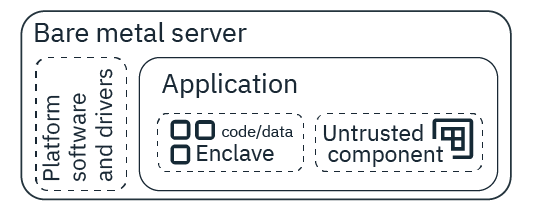

---

copyright:
  years: 2018, 2020
lastupdated: "2020-03-24"

keywords: provision, sgx, provision server Intel SGX architecture, Intel SGX architecture, confidential computing,

subcollection: bare-metal

---

{:shortdesc: .shortdesc}
{:codeblock: .codeblock}
{:screen: .screen}
{:external: target="_blank" .external}
{:pre: .pre}
{:table: .aria-labeledby="caption"}
{:tip: .tip}

# Provisioning a bare metal server with Intel Software Guard Extension architecture
{: #bm-server-provision-sgx}

Intel Software Guard Extensions (SGX) can protect data that uses hardware-based server security. With Intel SGX applications, you can protect select code and data from disclosure or modification. By using trusted execution environments (TEE), known as enclaves, you can encrypt the pieces of your application memory that contains sensitive data while it is in use.
{: shortdesc}

{: caption="Figure 1. Example SGX application set up" caption-side="bottom"}

<!--When you're developing a confidential computing application, you must design it in a way that you can segment the information that needs to be encrypted. At runtime, the segmented information is kept confidential through a process that is known as attestation. When communication occurs with the segmented code or application data, the enclave verifies that it is coming from the other part of the application before sharing any information with it. Through the attestation process, information is kept confidential and data leakage is prevented.-->

Even if you don't have an application that uses Intel SGX, you can still take advantage of the technology. Check out [IBM Cloud Data Shield](/docs/data-shield?topic=data-shield-getting-started).
{: tip}

## Provisioning your bare metal server with SGX
{: #provision-sgx}

To provision a bare metal server with SGX, follow these steps:

1. Create a customer server by following the procedure [Build a custom bare metal server](/docs/bare-metal?topic=bare-metal-ordering-baremetal-server)

2. Select the following options on the order form:

| Section | Option to select |
|------|------|
| Server | Single processor,  Intel Xeon E3-1270 v6 with Storage up to four drives |
| Image | - Windows Server 2016 Standard Edition (64 bit)  - Windows Server 2016 Standard Edition (64 bit)  - Windows Server 2016 Datacenter Edition (64 bit)   - CentOS 7.x (64 bit)   - Ubuntu Linux 16.04 LTS Xenial Xerus (64 bit)  - CentOS 7.x (64 bit)   - Red Hat Enterprise Linux 7.x (64 bit) (per-processor licensing) |
| Image Add-ons | Software Guard Extensions (SGX) |
{: caption="Table 1. Order form options" caption-side="top"}

## Installing Intel SGX plaform software and drivers
{: #install-intel}

When you're working with Intel SGX enabled bare metal servers, be sure that you also install the SGX platform software and drivers.

1. Go to the [Intel Open Source website](https://01.org/intel-software-guard-extensions/downloads){: external} and select the option for installation that matches your operating system.
2. Download the binary installation option. This makes sure that you're using a stable version of SGX in your workloads.
3. For specific instructions for each type of installation, see the [Intel SGX Installation Guide for windows](https://downloadcenter.intel.com/product/80895/Intel-Software-Guard-Extensions-Intel-SGX-for-Windows-){: external} or the [Intel SGX Installation Guide for Linux](https://download.01.org/intel-sgx/linux-2.1.2/docs/Intel_SGX_Installation_Guide_Linux_2.1.2_Open_Source.pdf){: external}.
